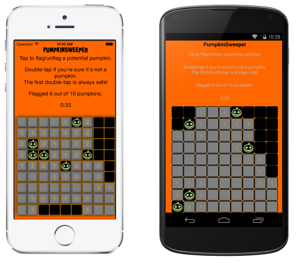

PumpkinSweeper (Xamarin.Forms)
==============================

Halloween version of BugSweeper
-------------------------------

**This is a fork of Charles Petzold's [BugSweeper sample](https://github.com/xamarin/xamarin-forms-samples/tree/master/BugSweeper) from [Evolve 2014](http://evolve.xamarin.com)**

**It incorporates the [@glyphish](https://twitter.com/glyphish/) [free Halloween icons](https://twitter.com/glyphish/status/527491592496504832).**

**The entire game is written in C# using [Xamarin.Forms](http://xamarin.com/forms) so it's almost 100% shared code!**

>Begin playing by double tapping any tile. That first double tap is always safe.
Thereafter, numbers indicate the number of surrounding tiles with PUMPKINS. 
If you know that a tile has a PUMPKIN, flag it (or unflag it) with a single tap.
Avoid double-tapping a tile with a PUMPKIN!

*Listen carefully if you fail!*

Author
------

Charles Petzold, minor halloween modifications by Craig Dunn