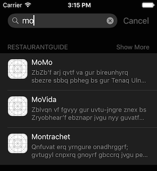
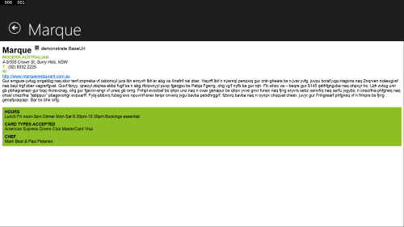

RestaurantGuide (Xamarin.Forms + Razor)
=========

This sample is an updated version of [RestaurantGuide](https://github.com/conceptdev/RestaurantGuide/).
This version uses [Xamarin.Forms](http://xamarin.com/forms) and [Razor cshtml templates](http://blog.xamarin.com/sharper-html-hybrid-apps-with-razor/).

Updated for iOS 9
-----------------

Implemented basic Search SDK (`CoreSpotlight`), thanks to Larry O'Brien (all hacks are mine).

Basic Features
--------

As with the old version, the text is obfuscated (since it's only a demo).

History
------

Sep-2015 - added CoreSpotlight API to iOS 9 app project

Jun-2015 - Now supports Windows Store and Windows Phone 8.1

Updated to use Xamarin.Forms.

Mar-2011 - Follow-up with [native Android](http://conceptdev.blogspot.com/2011/03/monodroid-meet-monotouch-windowsphone7.html).

Sep-2010 - The original [blog post](http://conceptdev.blogspot.com/2010/09/monotouch-meet-windowsphone7.html) with iOS and Windows Phone 7.
