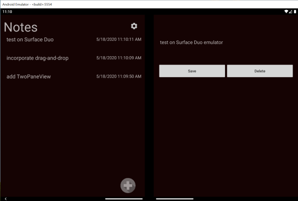

# Duo-Notes

This app is a simple master-detail demo built for the [Surface Duo](https://www.microsoft.com/surface/devices/surface-duo) using Xamarin.Forms.

This sample is based on the [Xamarin.Forms Get Started tutorials](https://docs.microsoft.com/xamarin/get-started/quickstarts/multi-page), specifically the [multi-page notes sample](https://docs.microsoft.com/samples/xamarin/xamarin-forms-samples/getstarted-notes-multipage/).

The Xamarin team built a neat demo called [XamarinTV](https://github.com/xamarin/app-xamarintv); I've borrowed some ideas from that (including the theme handling!), but stripped down to two simple views.

The sample uses the [TwoPaneView control](https://docs.microsoft.com/xamarin/xamarin-forms/app-fundamentals/dual-screen/twopaneview) to lay out a CollectionView and a 'details' view: across both screens when the app is spanned, but split when on a single screen (or regular Android device).

There is a settings view (accessed via the gear icon), which should always take up an entire screen (not be split). Check out the code in `MainPage.xaml.cs` to see how the `TwoPaneView` is configured to make that happen. The same behavior can be accomplished via MVVM and Triggers (see the XamarinTV [visual states](https://github.com/xamarin/app-xamarintv/blob/master/XamarinTV/Views/MainPage.xaml#L16-L65) and [view model](https://github.com/xamarin/app-xamarintv/blob/master/XamarinTV/ViewModels/MainViewModel.cs#L98-L122) for their solution).

## Build 2020

This sample was mentioned in the Microsoft Build 2020 session _How to bring your Android apps to Surface Duo with Xamarin_:

- [Build session samples](https://github.com/conceptdev/xamarin-forms-samples/tree/master/build-2020)
- [Build session video](https://aka.ms/M365SK123)

## Other samples

- [Xamarin.Forms Surface Duo samples](https://github.com/microsoft/surface-duo-sdk-xamarin-samples)
- [XamarinTV sample app](https://github.com/xamarin/app-xamarintv)
- [Food delivery sample app](https://github.com/jsuarezruiz/FoodDeliveryAppDuo)

## Docs

- [Get the Surface Duo SDK](https://docs.microsoft.com/dual-screen/android/get-duo-sdk?tabs=csharp)
- [Xamarin.Forms TwoPaneView](https://docs.microsoft.com/xamarin/xamarin-forms/app-fundamentals/dual-screen/twopaneview)
- [UWP Two-pane view docs](https://docs.microsoft.com/windows/uwp/design/controls-and-patterns/two-pane-view)
